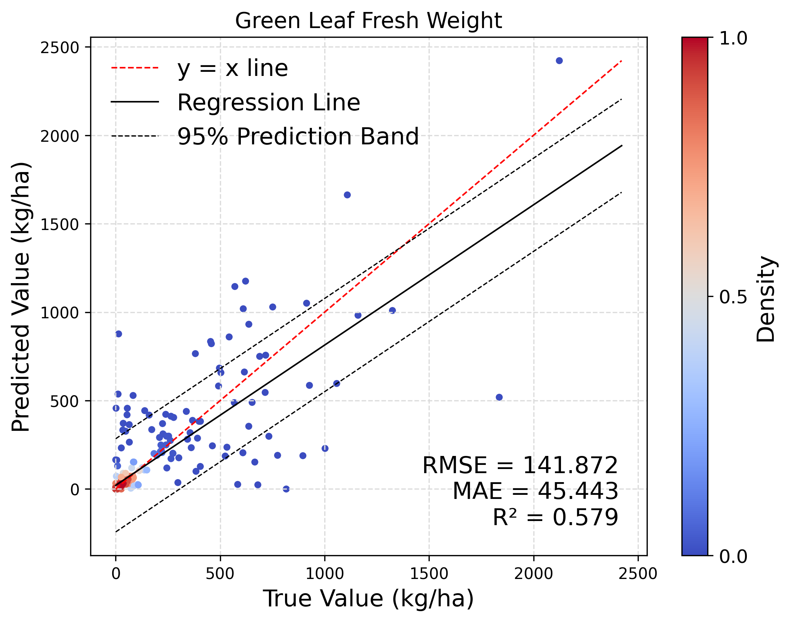
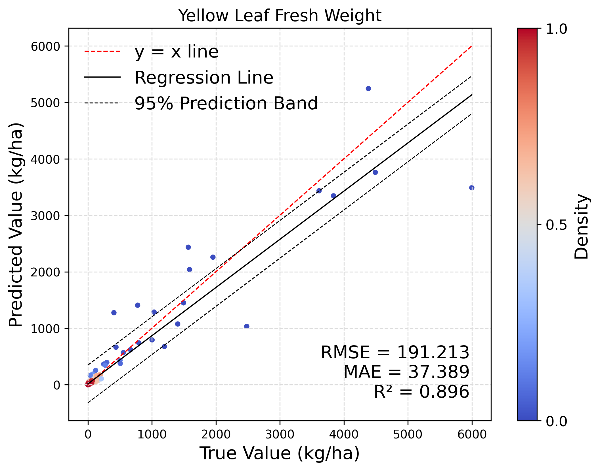
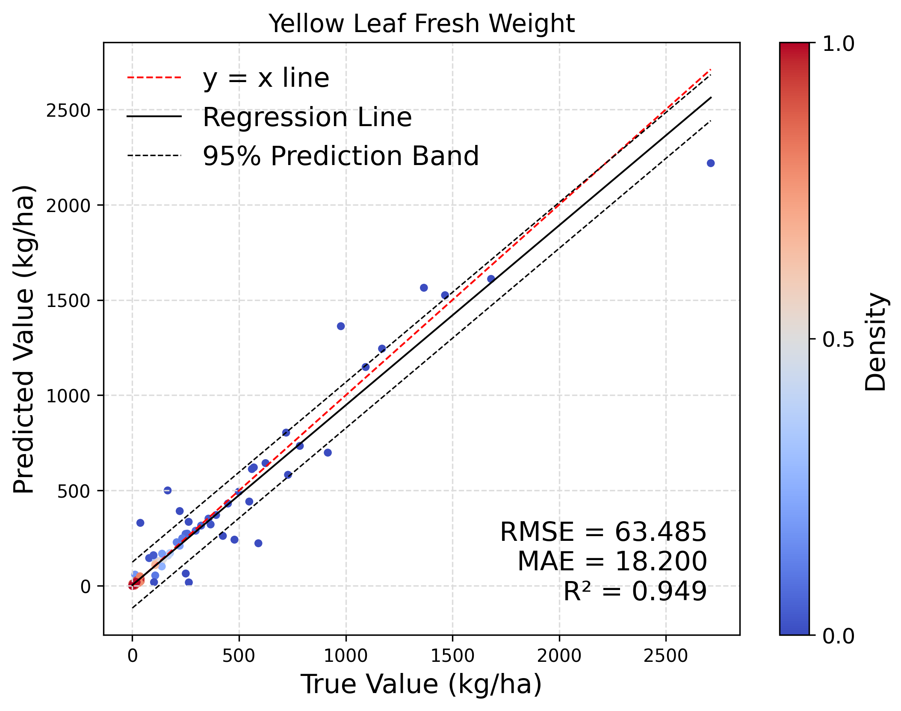

</img> 

## 天工开悟-农业生长大模型（KwooGr-V2.0）

> **天工不遗，以配万物；开悟不止，以成百谷。**
### :robot::seedling:模型简介

**天工开悟-农业生长大模型（KwooGr-V2.0）**是国内首个**人机友好、鲁棒输入、多作物兼容、多品系适应**的农业作物生长大模型。模型融合大豆、小麦、水稻、玉米等作物数据，覆盖北京、黑龙江、河南、山西等主要种植区。依托作物模拟器、农学文献与国家种植标准，累计采集并分析超过**1亿个生长周期**的数据，系统刻画了作物在不同阶段的叶面积、荚果鲜重、果穗鲜重等关键指标。

我们的模型具备以下核心特性：
- **多类型**：融合多种机理型作物生长模型，如**DSSAT、WOFOST**，实现多源机理增强计算；
- **泛品种**：涵盖**大豆、小麦、水稻、玉米**等主要粮食作物，并包含**2795个真实大豆品种**数据；
- **跨区域**：覆盖**北京、黑龙江、河南、山西**等典型种植区，集成**2004-2023年**，长达**20 年**的气象数据。

### :fire::trophy:News

- **[2025/10/23]** :rose::rose:我们正式发布**KwooGr-V2.0**——国内首个**多类型、泛品种、跨区域**的农业作物生长大模型！该模型具备**人机友好、鲁棒输入、多作物兼容、多品系适应**的特点，为**快速育种与跨地区泛化预测**提供了强有力的技术支撑。现已支持[Web端](https://www.tgkwai.com/) 、[Android端APP](#:iphone:天工开悟app-android版)访问。
- **[2024/11/20]** :star2::star2:发布**KwooGr App使用教程与测试用例**，帮助用户快速上手，全面体验模型在农业生产中的**高效性与易用性**，加速智能农业的落地应用。
- **[2024/11/20]** :boom::boom:推出**KwooGr API访问接口**！开发者与企业用户可轻松集成模型能力，助力农业领域的**智能化升级与精准决策**。
- **[2024/11/2]** :fireworks::fireworks:发布**KwooGr 初始版本** —— 国内首个农业作物生长大模型，为**快速育种与跨区域预测**提供了创新技术基础。

### :hammer_and_wrench::sparkles:数据集构建

#### :file_folder:基于SNP的真实大豆数据集

- 从文献中获取了覆盖**2898 个品种**的真实大豆基因型数据集，包含**31,580,805个单核苷酸多态性（SNP）位点**；
- 从中选取的**2795个品种**，文献报告其已于**2013-2015 年**在**北京、黑龙江、河南、山西**四省开展多点田间种植试验，获得**表型观测数据**（包括始花期、成熟期、百粒重等）；
- 根据试验时空坐标，通过**NASA API**获取相应的气象与环境数据，用于构建多维输入特征；
- 利用**Python Optuna优化框架**及其高效的**TPESampler 采样算法**，对2795个品种的**关键生长参数**（如各生育阶段温度阈值、有效积温及最适日照时长）进行自动化反演；
- 最终，基于校准参数的作物生长模型模拟结果显示：主要生育期的预测值与田间观测的**绝对误差低于5天**，其余表型指标的**相对误差控制在5%以内**，验证了数据集的精度与可靠性。

#### :link:多作物生长模拟器集成

|集成方式|集成内容|
|---|---|
|**生长模型**|**DSSAT**、 **WOFOST**|
|**作物品种**|**大豆、小麦、水稻、玉米**|
|**土壤环境**|统一采用肥力较高的**淤泥土**作为仿真土壤环境|
|**种植方案**|依据《2023年小麦水稻玉米马铃薯春夏季科学施肥指导意见》及《2023年黄淮海夏大豆生产技术意见》|
|**种植区域**|覆盖**北京、黑龙江、河南、山西**等主要种植区|
|**天气数据**|集成**2004-2023年**共**20年**的气象数据|

### :crystal_ball::gear:模型结构
- 在开源基模型**Qwen3-8B**的基础上进行结构优化。
- 通过多模态**全参微调**实现作物生长状态的**长距离预测**。
- 集成了**DSSAT、WOFOST**等传统作物生长预测功能，实现现代深度学习与经典机理模型的结合。

### :clapper::triangular_flag_on_post:模型使用演示

:one:输入目标区域的**经纬度**

:two:选择对应的**省市地区**

:three:输入**播种日期**（即作物播种当天的日期，格式：xxxx-xx-xx）

:four:填写**施肥记录**（包括底肥和追肥）

:five:输入**施肥详情**（1）施肥日期（2）施肥量（千克/公顷）（3）已种植天数（从播种日期起至当前日期的天数）

:six:输入**预测天数**（从当前日期起至目标预测日期的天数）

:seven:输入**查询问题**（目前支持的查询参数包括：植株鲜重、主茎鲜重、绿叶鲜重、黄叶鲜重、荚果鲜重、叶面积指数、总叶面积。查询示例： `"植株鲜重、主茎鲜重是多少？"`）

### :bar_chart::zap: 模型效果

在训练过程中，我们对**测试集**进行评估，得到模型的**准确率变化曲线**。

曲线展示了随着训练轮次增加，模型在测试集上的预测精度逐步提升的趋势，验证了模型的**收敛性与稳定性**。

<table align="center">
    <tr>
        <td>
            
        </td>
        <td>
            
        </td>
    </tr>
</table>

在生长数据预测上，模型表现出**很高的准确率**。

在输入之前的观测状态时，模型对大豆的**生长预测 $R^2>85\%$**，可用于预测作物全周期的表型性状，包括**绿叶鲜重、叶面积指数、主茎鲜重、荚果鲜重、总叶面积和黄叶鲜重**，为农民和农业专家提供精准指导。

<table align="center">
    <tr>
        <td>
            
        </td>
        <td>
            
        </td>
        <td>
            
        </td>
    </tr>
    <tr>
        <td>
            
        </td>
        <td>
            
        </td>
        <td>
            
        </td>
    </tr>
</table>

当仅输入天气数据时，模型预测能力略下降，但仍能达到大豆的 **$R^2>55\%$**。

<table align="center">
    <tr>
        <td>
            
        </td>
        <td>
            
        </td>
        <td>
            
        </td>
    </tr>
    <tr>
        <td>
            
        </td>
        <td>
            
        </td>
        <td>
            
        </td>
    </tr>
</table>

**大豆生长预测效果**：模型对**绿叶鲜重、叶面积指数、主茎鲜重、荚果鲜重、总叶面积和黄叶鲜重**的预测值与**WOFOST模拟器**的模拟值拟合度良好，**$R^2$ 均大于75%**，如下图所示：

<table align="center">
    <tr>
        <td>
            
        </td>
        <td>
            
        </td>
        <td>
            
        </td>
    </tr>
    <tr>
        <td>
            
        </td>
        <td>
            
        </td>
        <td>
            
        </td>
    </tr>
</table>

**小麦生长预测效果**：模型对**绿叶鲜重、叶面积指数、主茎鲜重、麦穗鲜重、总叶面积和黄叶鲜重**的预测值与**WOFOST模拟器**的模拟值拟合度良好，**$R^2$ 均大于60%**，如下图所示：

<table align="center">
    <tr>
        <td>
            
        </td>
        <td>
            
        </td>
        <td>
            
        </td>
    </tr>
    <tr>
        <td>
            
        </td>
        <td>
            
        </td>
        <td>
            
        </td>
    </tr>
</table>

**水稻生长预测效果**：模型对**绿叶鲜重、叶面积指数、主茎鲜重、稻穗鲜重、总叶面积和黄叶鲜重**的预测值与**WOFOST模拟器**的模拟值拟合度良好，**$R^2$ 均大于70%**，如下图所示：

<table align="center">
    <tr>
        <td>
            
        </td>
        <td>
            
        </td>
        <td>
            
        </td>
    </tr>
    <tr>
        <td>
            
        </td>
        <td>
            
        </td>
        <td>
            
        </td>
    </tr>
</table>

**玉米生长预测效果**：模型对**绿叶鲜重、叶面积指数、主茎鲜重、果穗鲜重、总叶面积和黄叶鲜重**的预测值与**WOFOST模拟器**的模拟值拟合度良好，**$R^2$ 均大于70%**，如下图所示：

<table align="center">
    <tr>
        <td>
            
        </td>
        <td>
            
        </td>
        <td>
            
        </td>
    </tr>
    <tr>
        <td>
            
        </td>
        <td>
            
        </td>
        <td>
            
        </td>
    </tr>
</table>

### :busts_in_silhouette::handshake: 项目参与者

**核心成员**：

- [沈汝佳](https://github.com/HITshenrj)
- [马舒庆]()
- [黄鸿睿](https://github.com/t-lights)
- [李远哲]()
- [黄楚皓]()
- [林耀雄](https://github.com/Greaklin)
- [刘博建]()
- [李舒朗]()

**指导教师**：

- [刘劼](https://drjieliu.github.io/) 教授
- [姜京池](https://homepage.hit.edu.cn/jiangjingchi) 副教授
- [杨洋](https://ai.cust.edu.cn/szdw/zrjs/3f60de2fb4634ee189b2cb9ce84a2d98.htm) 副教授
- [关毅](https://homepage.hit.edu.cn/guanyi) 教授

### :iphone: 天工开悟APP (Android版)

欢迎扫描下方二维码下载**天工开悟 APP**，体验智能农业问答功能。

:one:**首次登录**

- 打开APP后进入登录页面，可选择**本机手机号一键登录**或**手机验证码登录**。
- 登录前需勾选同意用户协议。

:two:**问答使用**

- 登录后直接进入**问答页面**，在下方输入框输入问题并等待回答。

:three:**语音对话功能**

- 点击输入框右侧的录音按钮进行语音输入，录音会实时转为文字。
- 录音完成后点击发送键提问。
- 回复内容下方提供**播放按钮**，可收听回答音频。

<table align="center">
    <tr>
        <td>
            网页端链接
        </td>
        <td>
            Android端链接
        </td>
        </tr>
    <tr>
        <td>
            
        </td>
        <td>
            
        </td>
    </tr>
</table>

### 致谢

我们的项目参考了以下工作，在此表示诚挚感谢。
* [DSSAT](https://dssat.net/)
* [APSIM](https://www.apsim.info/)
* [PCSE](https://github.com/ajwdewit/pcse)
* [Qwen](https://github.com/QwenLM/Qwen)